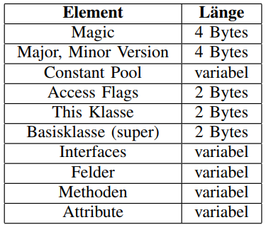
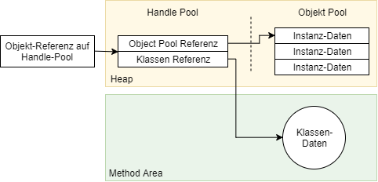
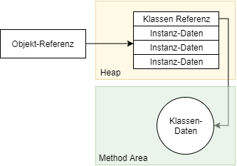
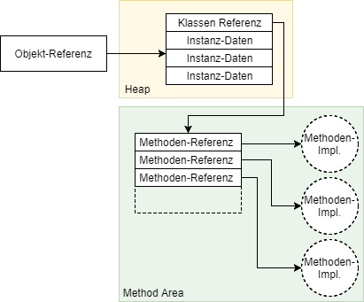
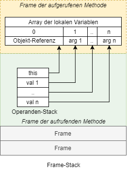
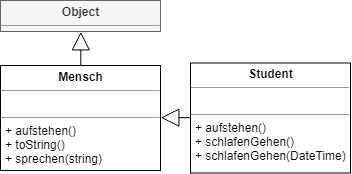
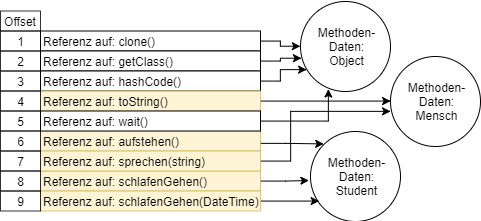

## Implementierung Objektorienterter-Konstrukte in der Java Virtual Machine


## Agenda
1. [Aufbau der .Class-Datei](#Aufbau der .Class-Datei)
2. [JVM Grundlagen: Stack & Heap](#JVM Grundlagen: Stack & Heap)
3. [Methodenaufrufe](#Methodenaufrufe)
4. [Konstruktor](#Konstruktor)
5. [Zugriff auf Felder](#Zugriff auf Felder)


## Aufbau der .Class-Datei




## JVM Grundlagen: Stack & Heap


### Stack
- Pro Thread eigener Stack mit Frames
- Frame enthält:
  - Operanden-Stack
  - Array der lokalen Variablen
  - Referenz zum Runtime-Constant-Pool


### Heap

- Geteilter Bereich
- Speicher der Objekt-Daten
  - Über Referenz auffindbar
  - Sichern der Objekt-Daten
  - Referenz zur genutzten Klasse
- Method Area


#### Method Area

- Enthält Infos zu Klassen und Interfaces, Runtime-Constant-Pool, Methodentabellen, ...
- *__Runtime-Constant-Pool:__* Laufzeitrepräsentation der Constant-Pools (class-Dateien)
- *__Methoden-Tabelle:__* Aufrufbare Methoden


#### Beispiele: Zugriff auf die Klassen-Daten




#### Beispiel: Von der Objekt-Referenz zur Methode



## Methodenaufrufe


#### Ablauf Methodenaufruf | Parameter

Instanz-Methode




- Opcodes zum Aufruf von Methoden haben einen Index als Operand
- Index entspricht Eintrag im Runtime-Constant-Pool (--> Methodendeskriptor)

```Java
invokestatic #3

#3 = Methodref #2.#22
#22 = NameAndType #8:#9
...
```


#### Aufruf Klassen-Methode: *invokestatic*
- Basiert auf dem verwendeten Typ der Referenz
```Java
Mensch oneHuman = new Student();
```
- Typ der Referenz:  ```Mensch```
- Es muss keine Objekt-Referenz aufgelöst werden (*static binding*)


#### Aufruf Instanz-Methode: *invokevirtual*
- Aufgerufene Methode ist abhängig vom Typ des Objekts

- Aber: Typ erst zur Laufzeit bekannt  
- **=>** Verzweigung vom Objekt zur Klasse notwendig 


#### Beispiel: Invokevirtual und Vererbung




#### invokespecial
- Aufruf soll auf dem Typ der Referenz und nicht der Instanz erfolgen
- Anwendungsfall:
  - Instanz-Initialisierung (```super```)


#### invokeinterface
- Referenz ist ein Inteface
- Methode muss immer "neu gesucht" werden *(kein fixer Offset*


## Konstruktor


- Java: ```new``` erzeugt neues Objekt
- JVM: Opcode ```new``` legt Objekt an und gibt eine Referenz zurück
	- Initialisierung über ```init```-Methoden


#### Beispiel: Konstruktor-Aufruf
```
Student sA = new Student();
```
```
new           #2                  
dup
invokespecial #3                 
astore_0
```
```
#2 = Class          #23
#3 = Methodref      #2.#22
#8 = Utf8           <init>
#9 = Utf8           ()V
#22 = NameAndType   #8:#9
#23 = Utf8          com/company/Student
```


## Zugriff auf Felder


- Zugriff auf Felder sehr ähnlich zu Methoden-Aufruf
- Unterscheidung in 
	- Instanz-Felder
	- Klassen-/Static-Felder


##### Beispiel: Instanz-Felder
Nutzung von ```getfield``` und ```putfield```

```Java
Student sA = new Student();
...
var x = sA.Name;
```
```
...
aload_0
getfield      #4
astore_1
```
```
#4 = Fieldref       #2.#27
#2 = Class          #26
#26 = Utf8          com/company/Student
#27 = NameAndType   #33:#21
#21 = Utf8          Ljava/lang/String;
#33 = Utf8          Name
```


##### Static-Felder
- Nutzung von ```getstatic``` und ```putstatic```
- Funktionsweise sehr ähnlich
	- keine Objekt-Referenz auf dem Operanden-Stack benötigt